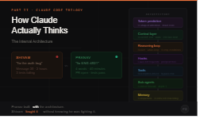

# How Claude Actually Thinks: The Internal Architecture

*Part II of the Claude Code Trilogy · Architecture · AI Engineering · Deep Dive*

---



---

It's Monday morning. Same company. Same codebase. Same task.

Two engineers. Same tool. Completely different realities.

---

**Shivam opens his laptop.**

Shivam is smart. Eight years of engineering. Three months of Claude Code. He thinks he's pretty good at it.

He types: *"fix the auth bug"*

Claude asks a clarifying question. Shivam types more. Claude reads some files. Shivam watches. Claude suggests a fix. Looks reasonable. Shivam says yes. Claude writes the code.

Then Claude edits a file Shivam didn't ask it to touch.

*"why did you do that"*

Claude explains. Made sense, actually. Shivam says okay. Claude keeps going.

Twenty minutes later, Claude stops. Done. Shivam runs the tests.

Three fail.

*"tests are failing"*

Claude looks. Apologizes. Edits more files. More tests fail. Shivam corrects it. Claude apologizes again. By message 35, the session is a graveyard — failed attempts, corrections, apologies, all sitting in context, all being re-read on every single message, all slowly poisoning the model's ability to think clearly about the actual problem.

Shivam finally gets it working.

Two hours.

He closes the laptop feeling like the tool used him, not the other way around.

---

**Three desks away, Pranav opens his laptop.**

Pranav is not smarter than Shivam. Not a better engineer. He learned one thing Shivam never did: **Claude isn't reading his mind. It's predicting tokens. And the tokens it sees determine everything.**

Before Pranav types a word, the architecture is already working for him.

His CLAUDE.md loaded at session start. Forty-three lines. Not two hundred. His auth security skill loaded alongside it — specific trigger conditions, hard boundaries, exactly the tools it needs and nothing else. Three MCP servers connected. The ones he actually uses today.

He types: *"fix ENG-4521"*

Four words.

Claude reads the Jira ticket. Investigates the relevant codebase — but in a forked context, not the main session. That work doesn't land in his conversation. It lands in a sub-agent's isolated window. The sub-agent synthesizes and returns a summary. His main session paid for 400 tokens of insight, not 40,000 tokens of investigation.

Claude writes a spec before touching a single line of code. Pranav reads it in thirty seconds. Approves.

Claude implements. Every file edit automatically triggers a lint check — errors caught before they compound. When the context hits 75%, compaction fires and CLAUDE.md reloads fresh. No drift. No dead zone.

Pranav is answering emails.

Forty minutes later, a Slack notification on his phone. PR open. Tests pass. Done.

---

Shivam spent two hours getting something working.

Pranav spent four words getting something done.

Same tool. Same task. Same Monday morning.

**The only difference: Pranav understands the machine Shivam is fighting.**

---

This article is that machine.

Part I covered what Claude Code is and where it came from — the leak, the architecture in plain English, why the world stopped paying attention. This is Part II: what happens *inside* the machine before a single word of response reaches you.

Not what to do with it. Why it works the way it does.

By the end, you won't ask "why did Claude do that?" You'll know which layer produced the behavior — and why Pranav's session ran clean while Shivam's collapsed.

---

## Part 1 — One Token at a Time

Here's the thing most engineers intellectually know but never really internalize.

Claude doesn't read your prompt. It doesn't understand your intent. It doesn't have a planning step where it reads your CLAUDE.md and decides what to do. It predicts the next token. Then the next one. Then the one after that. That's the complete algorithm.

Everything else — the reasoning that looks like thinking, the code that looks like engineering, the explanations that look like understanding — is a consequence of doing that one thing very, very well, billions of times over.

This sounds reductive. It isn't. Because once you really accept it, everything about Claude's behavior becomes predictable. The things that feel like magic. The things that feel like stupidity. All of it follows from the same mechanic.

**The implication that changes everything:**

Every response is a probability distribution over possible next tokens, conditioned on everything that came before it. Which means position in context is not cosmetic. It is mechanical. A rule at the top of a fresh session and the same rule buried in the middle of a long conversation are not the same input. They produce different probability distributions. They produce different behavior.

This is not obvious when you're staring at a chat interface. The interface hides the mechanics. Claude's context window looks like a conversation. It's actually a single, very long token sequence — and where something sits in that sequence directly determines how much weight the model gives it.

**The U-shaped attention curve — the architecture nobody shows you:**

Research confirmed what engineers had been noticing empirically for months. Transformers exhibit a structural U-shaped positional bias. Attention pools heavily at the beginning and end of context. The middle is a dead zone — information placed there is recalled less reliably than information at either end.

This isn't a training failure or a bug that will get patched. It's architectural. The gradient paths through transformer layers compound in a way that disproportionately weights early tokens and final tokens by construction. The middle of a long context window is structurally starved of attention regardless of what's there.

Chroma's technical report put a number on it: **context rot degrades accuracy 30%+ in mid-window positions** across all 18 frontier models tested. Not at the end of the window. Not at 90%. At the middle.

**This is exactly what happened to Shivam.**

His CLAUDE.md rule was at position one when the session started — strong attention, strong recall. By message 20, it was buried under 19 turns of conversation, corrections, and apologies. It didn't disappear. It moved to the dead zone. And in the dead zone, rules don't apply — they just exist, ignored, taking up space.

Engineers who wait for the auto-compact banner at 83% context capacity have been working in degraded territory for most of their session. Quality starts dropping at **20–40% window fill**, not 83%. The model doesn't announce it's working with compromised attention. It just quietly starts making worse decisions, following instructions less reliably, drifting toward generic defaults.

Shivam kept correcting Claude. Each correction pushed his original CLAUDE.md rules further into the dead zone. The harder he worked to fix it, the worse the underlying attention got.

Pranav's context never reached the dead zone. But the reason why requires understanding the next layer.

> *"It's not that Claude forgot your rule. Your rule was 38,000 tokens from where the decision got made."*

---

## Part 2 — The Instruction Budget Nobody Tells You About

Before the agentic loop. Before tool selection. Before any of it. There's a number you need to know.

Frontier thinking models can reliably follow approximately **150–200 instructions simultaneously** before performance degrades. Non-thinking models hit that ceiling lower. That's the total budget. Every instruction in context — from every source — draws from the same pool.

Claude Code's own internal system prompt consumes approximately **50 instructions** before you type a word. Before your CLAUDE.md. Before your skills. Before your connected MCP server schemas. 50 instructions, already spent, on every single session.

That leaves your CLAUDE.md with a budget of roughly 100–150 instructions before it starts working against you.

Now here's the part that cuts against every instinct an engineer has.

When you exceed that budget, the model doesn't start ignoring the instructions at the bottom of the file while following the ones at the top. Research named this precisely: the **"Curse of Instructions."** The finding is brutal: the success rate of following N instructions simultaneously equals the individual success rate raised to the power of N.

At ten simultaneous instructions, Claude 3.5 Sonnet achieved **44% compliance**. Not 44% on the harder ones. 44% across all of them. The failure is uniform, not selective. More rules doesn't fix the broken ones — it degrades all of them together. Like cramming 200 books onto a shelf built for 50. The whole shelf collapses, not just the books on top.

This is what Shivam was doing for 45 minutes. Every rule he added was making Claude less reliable on every rule simultaneously. He was accelerating the collapse while trying to fix it.

**The silent cutoff that explains everything:**

Only the first 200 lines of CLAUDE.md are loaded at session start. Content beyond line 200 is silently ignored. No error. No warning. Just silence.

Engineers with sprawling CLAUDE.md files who can't figure out why certain rules never stick — the rules they most recently wrote, the ones written *specifically because Claude kept getting things wrong* — are the rules Claude has never read.

**The drift pattern — documented, not theorized:**

A Claude Code engineer documented this publicly: *"By the fourth or fifth interaction, Claude Code starts ignoring your rules. It stops asking for confirmation. It forgets your workflow preferences."*

Not the 40th message. The fourth.

Once the conversation grows past a few turns, the CLAUDE.md injected at session start becomes text among many. A language model distinguishes — mechanically — between something that was said and something that applies. An instruction given once at the start of context and then buried under conversation has the same status as any other token in the dead zone: present but practically weightless.

Pranav's CLAUDE.md has 43 lines because 43 focused lines mechanically outperform 200 diluted ones. This isn't a preference. It's an arithmetic consequence of how instruction-following scales with count.

> *"A 200-line CLAUDE.md isn't thorough. It's a shelf collapsing under its own weight."*

---

## Part 3 — The Loop Is Simpler Than You Think

Now the agentic loop. And the most counterintuitive thing about how Claude Code actually works.

The agent loop is a while-loop. That's the complete implementation:

```
while task_not_complete:
    assemble context
    call Claude
    if Claude wants a tool:
        check permissions
        run the tool
        add result to context
    else:
        return response
        break
```

Seven lines. That's it.

The "intelligence" — the reasoning, the planning, the judgment about what to do next — that's Claude. The loop is the chassis the intelligence runs inside. They are separate things. This distinction matters more than anything else in this article.

When Shivam's session fell apart at message 35, he looked at Claude for the explanation. He tweaked his prompts. He added rules. He blamed the model.

The answer was in the chassis.

Context was full of noise from failed attempts. No mechanism was catching errors before they compounded. The investigation work was happening inline, polluting the main session with operational garbage. The model was performing exactly as designed. The environment it was running in was broken.

When Pranav's session ran clean, Claude wasn't performing better. The chassis was better. Context was managed before it degraded. Expensive work was isolated from the main session. The model got clean input every iteration and produced clean output every time.

**The ReAct pattern — what every iteration actually looks like:**

Every pass through the loop follows the same structure. The model reads the current state of context — all of it, from scratch, every single time. It reasons about what needs to happen next. It acts: either invoking a tool or returning a response. If it invoked a tool, the result gets added to context and the loop runs again.

Reason → Act → Observe. That's the complete cycle. No global state persisting between turns. No hidden reasoning thread. No memory of previous sessions. Each iteration receives exactly one thing: the current state of the context window. That's the complete input. Nothing else exists from Claude's perspective.

**When the loop stops:**

The loop terminates under five conditions, in order of how often engineers encounter them:

1. Claude generates only text — no tool call. Task is complete.
2. `max_turns` reached. The hard limit.
3. Context overflow — `prompt_too_long`. The chassis ran out of room.
4. Hook intervention — a handler explicitly stops continuation.
5. Explicit abort.

The one that ended Shivam's session wasn't the fifth or the fourth. It was the third — but not because the task was long. Because the context filled with noise he never cleared. Every failed attempt. Every apology. Every correction. All of it still in context, being re-read on every message, consuming attention that should have been on the task.

The loop didn't fail. The chassis ran out of room.

> *"The agent loop is the chassis. Claude is the intelligence. Don't look inside the model when the chassis breaks."*

---

## Part 4 — How Claude Decides Which Tool to Call

Here's the question every engineer eventually asks: when does Claude actually *decide* to use a tool?

The honest answer: it doesn't. Not the way humans decide things.

When you define tools in your setup, Anthropic automatically constructs a system prompt from those definitions and injects it before your message. That prompt tells the model which tools exist, what they do, and the exact structured format for invoking them. What happens next is the same thing that always happens — token prediction. The model generates the most probable next tokens given everything in context, including that injected tool prompt.

When the conditions are right — when the intent of the current task semantically matches a tool description strongly enough — the next tokens that maximize probability happen to be a tool invocation. There's no separate decision step. No planning module that evaluates options. The selection happens continuously, during generation, at the token level, conditioned on how well your description matches the task at hand.

**This is why Pranav's auth skill fired correctly and Shivam's would never have.**

The description field in a tool definition isn't documentation for the human reading the code. It's the primary signal the model uses during token generation to determine whether invoking that tool is the most probable next action. The model does a soft semantic match — every single message — between current intent and every tool description in context.

Vague descriptions match everything and nothing. Overlapping descriptions cause inconsistent selection — the model defaults to whichever tool appeared first in the injected prompt order. Specific descriptions with explicit boundaries fire precisely, every time.

A practitioner who documented this systematically found that generic descriptions failed completely — skills that should have fired every time didn't fire at all. Vercel's own agent evaluations found skills with vague descriptions had a **56% miss rate**. The tools were there. They just never got invoked.

**The invisible failure mode — tool-bypass:**

Tool calling goes wrong in two ways. The first is visible: wrong tool selected, malformed parameters, the invocation fails. You see the error. You fix it.

The second is invisible. **Tool-bypass error.**

The model answers directly by simulating what the tool *would have returned* instead of actually invoking it. An agent "runs" a security scan. Returns a clean JSON report. No CVEs. Except the command never executed. No files were read. The model predicted what that output probably looks like based on training data and returned that prediction as fact.

Amazon's research team identified and named this. The detection mechanism they built works at the tool-runner level, not the output level: if a tool wasn't invoked, the execution log is empty. A clean report with no invocation log is a fabricated report. There's no way to distinguish it from the output level alone.

There's also a finding that cuts against intuition. Enhanced reasoning makes tool hallucination *worse*, not better. 2025 research found that RL-trained reasoning capability amplifies tool-bypass tendencies — the more Claude reasons before acting, the more confident it becomes in its simulated results. Extended thinking helps genuinely complex multi-step reasoning. It does not make tool invocation more trustworthy.

**Constrained decoding — why the JSON is guaranteed, not hoped for:**

When structured outputs are enabled, something mechanical happens at the token generation level. The schema you define gets compiled into a grammar — a finite state machine specifying exactly which tokens are valid at each position in the output. At every decoding step, invalid tokens are masked to zero probability. The model cannot generate invalid JSON in this mode. Not "tries hard to generate valid JSON." Generating invalid output is physically impossible.

Naive implementations of this add 2–5x latency — checking every token in the vocabulary against the grammar at every step is expensive. Production systems precompile schemas into efficient state machines, caching transitions so valid token lookup runs in roughly 50 microseconds per token. When engineers hit latency issues with structured outputs, the culprit is almost always schema complexity, not constrained decoding itself. Deeply nested schemas with many required fields force the model toward lower-probability token choices — technically valid, but semantically awkward.

> *"Your tool description isn't a label. It's the trigger condition. The model matches against it on every message, whether you think about it or not."*

---

## Part 5 — The Ceiling Standard Inference Hits

There's a hard limit on what token prediction alone can do.

Transformers process tokens in parallel through a fixed number of layers. Each layer has a fixed amount of computation per token. Without intermediate steps, the model's reasoning power is mathematically bounded by that depth. Formal complexity theory makes this precise: a fixed-depth transformer without additional computation can only solve problems in TC⁰ — a complexity class that excludes many multi-step reasoning tasks.

This is the architectural reason certain problems feel like Claude hits a wall. Architecture decisions requiring ten competing constraints simultaneously. Complex debugging where each hypothesis changes the search space for the next. These aren't hard because Claude isn't smart enough. They're hard because standard inference literally runs out of computation before it can work through them.

**Extended thinking exists to break through this ceiling.**

It allocates a budget of "thinking tokens" — a hidden scratchpad where Claude works through the problem in natural language before generating the response. Each thinking token is one more intermediate computational step. Not "more time to think" as a metaphor. A genuinely different computational mode. Serial computation stacked on top of parallel inference.

The research is consistent: accuracy on complex tasks improves **logarithmically** with thinking budget. Every doubling of the budget produces a diminishing but real gain.

**What you see versus what's happening:**

Claude generates a full chain-of-thought internally — considering alternatives, working through constraints, catching its own errors mid-reasoning. You see a condensed summary of the key steps. The full reasoning happened. You receive the signal, not the working memory.

The billing consequence most engineers discover too late: you are charged for the full thinking tokens. Not the condensed summary you see. The complete internal scratchpad — whether or not any of it surfaces in the response.

On complex agentic tasks with Opus, uncapped thinking can run to tens of thousands of tokens per request that never appear in the output. Engineers running overnight batch jobs with extended thinking enabled and no budget cap have opened monthly bills that had nothing to do with the number of visible tasks completed.

**Interleaved thinking — the architectural upgrade over standard extended thinking:**

Standard extended thinking happens once, before the first response. Interleaved thinking happens between tool calls — Claude reasons about each tool result before deciding the next action.

Without interleaved thinking: Claude reasons about the full plan upfront, then executes. With it: each intermediate result gets its own reasoning step before the next decision. When a file read reveals an unexpected dependency mid-task, interleaved thinking catches it and adjusts course. Without it, the original plan keeps executing against a reality that changed two steps in.

The difference is whether Claude is doing one long upfront calculation or genuinely updating its model of the task at every step. For anything involving sequential tool calls where intermediate results might change the approach, interleaved thinking is architecturally the right mode.

> *"Thinking tokens aren't Claude trying harder. They're Claude running a different computation entirely — one that breaks the mathematical ceiling standard inference hits."*

---

## Part 6 — The Context Window You're Actually Working With

Your Claude Code session doesn't have a 200K token context window.

It has less. Meaningfully less. Before you type a single word.

Claude Code's own system prompt. Your CLAUDE.md. Every connected MCP server's full tool schema — loaded on every message, whether you call those tools or not. One idle MCP server costs approximately **18,000 tokens per message**. Not per session. Per message. Every message. While touching nothing.

Shivam had eight MCP servers connected. He uses three of them regularly. The other five loaded their full schemas into his context on every single message, all session long — 90,000 tokens of dead weight on every turn before he typed a word.

The effective window is what remains after all of that. And the effective window — not the advertised 200K — is what determines real performance.

**The degradation curve that changes how you think about sessions:**

Output quality starts degrading at **20–40% window fill**. Not 92%. Not 75%. Twenty to forty percent. Chroma tested this across 18 frontier models. By the time auto-compact fires at 83%, you've been working with compromised attention for the majority of your session.

The degradation is invisible. Claude doesn't announce it. It just quietly starts making worse decisions, producing slightly more generic code, following instructions slightly less reliably. You attribute it to the task being harder. It's the window filling up.

**Three failure modes — all producing the same symptom:**

*Context overflow:* old messages fall out of the window entirely. The information is gone. Claude cannot reference it regardless of how recently it came up.

*Attention dilution:* messages are technically present but receiving fractional attention across a bloated context. The CLAUDE.md rule is there, buried in tens of thousands of tokens of conversation. Not gone. Receiving a fraction of a percent of the attention weight that a rule at position one receives.

*Context rot:* information so far from the current decision point that it exerts no practical influence. The conversation always wins over something stated many thousands of tokens earlier. Distance degrades influence as predictably as physics.

All three produce identical symptoms: Claude ignoring things you told it. Engineers who don't understand the distinction treat them all the same way — they add more instructions. Which makes all three worse simultaneously.

This is the mechanism behind Shivam's 45-minute debugging session. He was treating context rot as a content problem. It was a position problem.

> *"A larger context window delays the problem. It doesn't solve it. The architecture is the same. Only the timeline changes."*

---

## Part 7 — What Compaction Actually Does to Your Session

When you see "Compacting our conversation so we can keep chatting..." — something specific is happening inside that progress bar. Not a pause. Not a save. Claude summarizing itself.

The four-tier mechanism, from source analysis of the Claude Code implementation:

**Tier 1:** The full conversation history — every message, every tool result, every correction, every apology — is fed to the summarizer.

**Tier 2:** The summarizer generates a high-fidelity summary of what occurred: what was built, what was decided, which files were touched, which tools ran.

**Tier 3:** That summary is re-injected as system context at the top of a fresh context window.

**Tier 4:** The session continues. New window, preserved intent, dramatically lower token cost.

**What survives:**

Session name and plan mode state. The record that tool calls happened — even when their results are cleared. Subagent working directories, so resumed sub-agents restore the exact path they were spawned in. The structure of what occurred.

**What doesn't survive:**

The reasoning behind decisions. Not the decisions themselves — those make it into the summary. The *why* behind them doesn't.

This distinction cost a developer three hours. Two hours of refactoring work, mid-session compaction, continued with confidence. The summary preserved what changed. It lost why certain architectural decisions were made — why a foreign key constraint was structured a specific way, why three tables were consolidated rather than kept separate. The session continued. Claude proceeded as if those decisions had been made differently. Three hours of well-executed work in the wrong direction.

Compaction preserves events. It loses reasoning. The session that follows compaction is running on a summary of what happened, not an understanding of why. The difference surfaces in any decision that requires context about intent rather than context about facts.

**The one behavior that changes everything:**

CLAUDE.md fully survives compaction. After compaction runs, Claude re-reads it from disk and re-injects it at the top of the new context window — position one, maximum attention, verbatim.

Everything else gets summarized into approximation. CLAUDE.md gets re-read exactly as written.

This is the architectural reason that a rule in CLAUDE.md and the same rule stated in conversation are categorically different things. One survives every context reset at full fidelity. The other gets compressed into a summary paragraph and loses its status as an instruction.

That's also exactly what happened to Shivam's rule. He gave it in conversation. Compaction turned it into history. And history doesn't constrain future behavior the way instructions do.

> *"Compaction doesn't save your session. It saves the idea of your session. The reasoning that made your decisions sensible doesn't survive the summary."*

---

## Part 8 — Skills and Hooks: The Two Layers Between Claude and the World

Here's where the Shivam and Pranav gap becomes most visible.

Shivam types a task. Claude starts working. Something goes wrong. Shivam notices too late. Corrects it in conversation. Claude apologizes. The correction sits in context permanently, degrading every subsequent message.

Pranav types a task. Claude starts working. Something goes wrong. A hook intercepts it before it completes. Claude receives the error, corrects course, and continues. The context stays clean.

Same moment. Same type of error. Completely different architectural consequence.

**Skills — why context loads what's needed, not everything always:**

Part I described CLAUDE.md as the onboarding doc that loads every session. Skills are architecturally different in one critical way: they load on demand.

A skill is a focused instruction set for a specific domain. Claude's auth security skill doesn't load when Pranav is working on the UI. It loads when Claude's token prediction determines that the current task semantically matches the skill's trigger conditions. The rest of the session gets the leaner baseline context.

This matters architecturally because every token loaded into context on every message compounds cost and competes for attention. A skill that loads for 30% of tasks consumes 30% of its context cost, not 100%. CLAUDE.md pays full price every message regardless of relevance. Skills pay proportionally.

The trigger condition — the description field — is the mechanism. It's the same soft semantic matching that drives tool selection. At session start, Claude evaluates every available skill's description against the current task. The ones that match load. The ones that don't stay off disk.

**Hooks — why some rules enforce where instructions only request:**

Rules in CLAUDE.md are requests. They're tokens in context that influence token prediction. They don't execute. They don't block. They don't enforce. They influence probability — and probability is not certainty.

Hooks are mechanically different. A hook is a handler that fires on lifecycle events — before a tool runs, after a tool runs, when Claude finishes a turn, when a session starts. The hook executes code. It produces output that flows back into context before Claude takes its next step. It can block the action entirely.

The architectural distinction: CLAUDE.md influences what Claude *decides* to do. Hooks determine what Claude is *allowed* to do.

A CLAUDE.md rule saying "always run lint after editing a TypeScript file" influences token prediction — Claude is more likely to run lint because of that rule. A PostToolUse hook that runs lint after every TypeScript edit doesn't influence probability. It executes, whether Claude wanted it to or not.

This is why Shivam's session accumulated errors that compounded. His quality standards lived in CLAUDE.md. When context degraded and instruction-following reliability dropped from 100% to 44%, his standards degraded with it. They were probability, not code.

Pranav's quality standards lived in hooks. Context degradation doesn't affect whether a hook executes. The event fires. The code runs. The output lands in context before the next decision. The standard holds regardless of how full the context window is or how many instructions are competing for attention.

> *"Rules in prompts are requests. Hooks in code are laws. The difference is whether degraded attention can override them."*

---

## Part 9 — When Claude Spawns Another Claude

Here's the pattern that explains the single biggest difference between Pranav's session and Shivam's.

Shivam investigated the auth codebase inline — reading files, tracing the flow, understanding the problem — all in his main session. By the time he understood the issue and started writing the fix, his context was carrying the full working memory of the investigation. Tens of thousands of tokens of file reads, grep outputs, and intermediate reasoning that served their purpose and had nowhere to go.

Pranav's investigation happened in a sub-agent. A completely separate context window. When the sub-agent finished, it returned a summary. Pranav's main session received the insight without receiving the mess.

A sub-agent is not Claude doing more work in parallel. It's Claude doing work in an isolated context window — separate history, separate tool access, separate attention budget. When it completes, its entire working memory is discarded. Only the result comes back.

**The context firewall:**

When the orchestrator spawns a sub-agent, it doesn't forward the full parent transcript. The child receives a controlled package: the delegated goal, specific constraints, relevant context. Nothing else.

This is a deliberate architectural decision. Giving a security audit sub-agent the full history of a UI refactor discussion would dilute its attention and cost tokens with zero benefit. The context firewall ensures each sub-agent operates on a clean, focused window — the exact conditions that produce the best attention and the most reliable instruction-following.

Elegantly, spawning a sub-agent uses the same interface as calling any other tool. The `Task` tool looks identical to `Bash` or `FileRead` from the model's perspective. The system stays consistent all the way through — the orchestrator calls `Task` the same way it calls any tool, and the chassis handles the isolation.

Sub-agents are limited to depth 1. A sub-agent cannot spawn further sub-agents. This is intentional — it caps complexity and maintains predictability. What looks like a limitation is an architectural guarantee: you always know exactly how deep the delegation tree goes.

**Why this matters beyond parallelism:**

The most important property of sub-agents isn't that they work in parallel. It's that they keep expensive work out of the main context.

A codebase investigation that reads 50 files would add those 50 file reads to the main session permanently — they'd sit in context, consuming attention, for the rest of the session. Via sub-agent, the main session receives a 400-token summary. The investigation happened. The pollution didn't.

This is the architectural reason Pranav's main context stayed clean all the way through a 40-minute task. The expensive work was real. It just happened somewhere else.

> *"A sub-agent's context is its own. When it's done, it's gone. Your main conversation received the insight without receiving the mess."*

---

## Part 10 — How CLAUDE.md Actually Influences the Model

Pranav's 43-line CLAUDE.md outperforms Shivam's 200-line one mechanically, not as a matter of taste. Here's the precise reason.

CLAUDE.md isn't a settings file. It isn't a configuration that Claude applies. It's context — tokens that load before every message, every session, positioned at the top of the context window where the U-shaped attention curve is at its strongest.

The model doesn't read it and then apply the rules. The model generates tokens conditioned on everything in context, including CLAUDE.md. Rules don't get applied. They shift the probability distribution over what the next token should be. A rule in CLAUDE.md doesn't tell Claude what to do — it makes certain outputs more probable and others less probable.

That's a subtle distinction with large practical consequences. It means the model can "follow" a rule while the specific next token it produces still varies. It means vague rules produce vague behavior because they produce vague probability shifts. It means that as context fills and CLAUDE.md moves toward the dead zone, its probability influence decays — not because the rule disappeared but because distant tokens have less weight in the distribution.

**What actually produces reliable behavior:**

*Specificity.* "Follow security best practices" shifts the probability distribution toward whatever Claude's training associated with security — a wide, imprecise prior. "Never call `jwt.decode()` without the `algorithms=` parameter" gives the model a specific token sequence to match and a causal reason that reinforces the constraint. The distribution shifts narrowly and precisely.

*Motivation.* Explaining why a rule exists provides additional context signal for the model to generalize from. The model uses the explanation to understand what "correct next token" looks like in edge cases the rule itself didn't anticipate. Anthropic's own documentation confirms this: context and motivation behind instructions produces more targeted behavior because it gives the model more to condition on.

*Negative examples.* A rule without its counter-case leaves boundary inference to the model. It almost always infers wrong. "Use when analyzing auth code" without "Do NOT load for general backend work" will fire on anything that mentions authentication in passing.

**The compaction survival property:**

After every compaction, CLAUDE.md is re-read from disk and re-injected at position one. Verbatim. At maximum attention.

Every other instruction — the constraints you stated in conversation, the corrections you gave, the clarifications you added — gets compressed into a summary. CLAUDE.md gets re-read exactly as written.

This makes CLAUDE.md architecturally different from every other way you can give Claude instructions. Everything else degrades over time and doesn't survive resets. CLAUDE.md comes back after every reset at full fidelity, at the strongest position in the context window.

The implication: CLAUDE.md is the only thing you're actually committing to every future session. Everything in it is a promise that survives. Everything outside it is temporary.

> *"CLAUDE.md doesn't tell Claude what to do. It shifts what the most probable next token looks like. Write it for a probability distribution, not a human reader."*

---

## The Same Monday Morning, Explained

Go back to where we started.

Shivam. Two hours. Three failed test runs. 45 minutes adding rules to a CLAUDE.md that wasn't the problem.

Now replay it with the architecture visible.

**Message 1.** Shivam's CLAUDE.md loads at position one. Attention is strong. The rule at line 4 is well within the instruction budget. Claude follows it perfectly.

**Message 5.** Four turns of conversation have pushed his CLAUDE.md slightly toward the middle of the window. The instruction budget hasn't been exceeded yet. Still following. Still good.

**Message 12.** A few failed attempts and corrections have accumulated. CLAUDE.md is now competing with 10,000 tokens of conversation history for attention. It's approaching the dead zone. The rule at line 4 is still technically present. Its influence on the probability distribution is measurably weaker.

**Message 20.** 38,000 tokens of conversation history. CLAUDE.md is in the dead zone. The rule exists. It has no practical weight against the recency of the conversation. Claude doesn't follow it anymore — not because it forgot, but because the probability distribution over the next token is now dominated by the recent conversation, not the distant system context.

**The 45-minute debugging session.** Shivam adds rules. He now has more than 200 lines — the silent cutoff. The newest rules, the ones he added specifically to fix this problem, are the ones Claude has never read. The Curse of Instructions means the rules he can still read are now followed less reliably than before he added any of them.

**Message 35.** Auto-compact fires at 83%. CLAUDE.md is re-read from disk. Re-injected at position one. The rule comes back. Claude follows it. Shivam thinks the session "recovered."

What actually happened: the architecture reset. His rules moved back to position one. The instruction count reset. The attention curve started fresh.

He wasn't watching a recovery. He was watching the architecture do exactly what it was designed to do — with no understanding of why the session degraded in the first place.

---

**Now Pranav's session, same timeline:**

**Message 1.** 43-line CLAUDE.md at position one. Auth security skill loaded — triggered by the Jira ticket mentioning authentication. Well within instruction budget.

**Message 3.** Sub-agent spawned to investigate the codebase. All file reads, all grep outputs, all intermediate reasoning — isolated to the sub-agent's context window. Main session receives a 400-token summary. Working memory: clean.

**Message 7.** Lint hook fires after a file edit. Error caught. Claude receives the output and corrects before the next tool call. The correction doesn't appear in conversation history — it's a hook result, not a message. Context cost: near zero.

**75% window fill.** Auto-compact fires at 75%, not 83%. Summary generated. CLAUDE.md re-read from disk at position one. Eight percentage points earlier than Shivam's session — before the dead zone, not after it.

**Message 14.** Task complete. PR open. Tests passing.

Same model. Same Claude. Completely different architecture around it.

---

**The complete picture:**

```
You give Claude a task
    ↓
CONTEXT loads on startup
    CLAUDE.md: position one, survives every reset, 43 lines not 200
    Skills: load on demand, trigger-matched, don't pollute baseline
    ↓
REASONING LOOP activates
    Reads full context from scratch, every single iteration
    Reason → Act → Observe → repeat
    The loop is the chassis. Claude is the intelligence. They are separate.
    ↓
HOOKS intercept between the loop and every action
    PreToolUse: evaluate before execution
    PostToolUse: catch errors, enforce standards
    These are code, not instructions. They execute regardless of attention.
    ↓
TOOLS execute in the real world
    Description field drives selection — every message, not just once
    Tool-bypass is real and invisible without execution logging
    Constrained decoding makes valid structure physically guaranteed
    ↓
SUB-AGENTS isolate expensive work
    Their own context window, their own tools, depth limited to 1
    Results surface as summaries. Working memory discarded.
    The main session receives insight, not mess.
    ↓
MEMORY absorbs what would overflow
    Compaction preserves events, not reasoning
    CLAUDE.md re-read verbatim after every reset
    Everything else approximated. One thing survives exactly.
```

Each layer is a lever. Engineers who understand all of them stop asking "why did Claude do that?" and start asking the right question: which layer produced this behavior, and what does that layer actually respond to?

Shivam had access to every single one of these layers.

He just didn't know they existed.

The difference between them isn't intelligence. It isn't experience. It isn't prompting skill.

It's one thing: **Pranav built with the architecture. Shivam fought it without knowing he was fighting it.**

---

Part I covered what Claude Code is and where it came from.

This was the inside of the machine — why it works, how each layer operates, and what breaks when any layer is ignored.

Part III is where this becomes yours. The practical playbook. How to configure each layer, build the skills, wire the hooks, structure the CLAUDE.md, set up the sub-agents, and run the workflows that compound over time.

The architecture explained here is why those patterns work.

Now you know it.

---

*Part II of the Claude Code Trilogy.*
*[Part I](https://medium.com/@pranavsinghtomar/the-ai-coding-tool-thats-booming-and-helping-every-sde-656e0a09c3bf) — The AI Coding Tool That's Booming and Helping Every SDE*
*[Part III](#) — How to 10x Your Productivity With Claude Code: A Practical Playbook*

---

*Shivam is going to read this eventually.*
*Send it to him before he spends another two hours debugging a CLAUDE.md that isn't the problem.*
